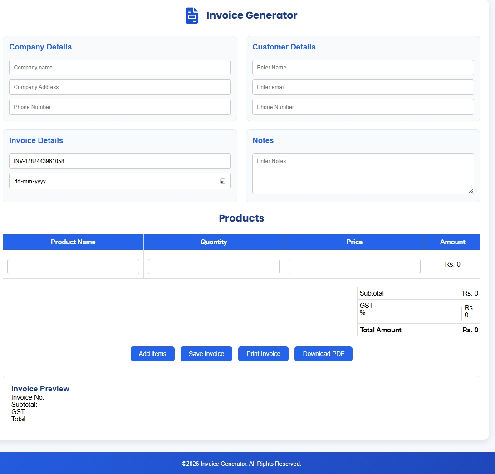

# 🧾 Invoice Generator

A responsive and user-friendly **Invoice Generator** built using **HTML, CSS, and JavaScript**. This project helps users create professional invoices by entering customer details, adding multiple products/services, calculating totals automatically, and printing the final invoice.

---

## 📌 Features

* ✨ Add customer and company details
* ➕ Add or remove invoice items dynamically
* 🧮 Automatic subtotal calculation
* 💰 GST/Tax calculation
* 💵 Automatic grand total calculation
* 🔢 Auto-generated invoice number
* 💾 Save invoice data using Local Storage
* 🖨️ Print invoice
* 📱 Fully responsive design

---

## 🛠️ Tech Stack

* HTML5
* CSS3
* JavaScript (ES6)
* Local Storage API

---

## 📂 Project Structure

```
Invoice-Generator/
│── index.html
│── style.css
│── script.js
│── assets/
│── README.md
```

---

## 🚀 How to Run the Project

1. Clone the repository

```bash
git clone https://github.com/your-username/invoice-generator.git
```

2. Open the project folder.

3. Open `index.html` in your browser.

No installation or additional dependencies are required.

---
## 📸 Screenshot



## 🎯 Learning Outcomes

This project helped me improve my understanding of:

* DOM Manipulation
* Event Handling
* JavaScript Functions
* Dynamic Table Creation
* Local Storage
* Responsive Web Design

---

## 🔮 Future Improvements

* Generate Invoice PDF
* Email Invoice
* Customer Management
* Multiple Invoice Templates
* Currency Selection
* Dark Mode
* Invoice History
* Export to Excel

---

## 👩‍💻 Author

**Soni Yadav**

GitHub: https://github.com/soni-701

---

## ⭐ Support

If you found this project helpful, consider giving it a ⭐ on GitHub!

